# Домашнее задание к занятию "Базы данных в облаке" - Tarkov Viktor


### Инструкция по выполнению домашнего задания

   1. Сделайте `fork` данного репозитория к себе в Github и переименуйте его по названию или номеру занятия, например, https://github.com/имя-вашего-репозитория/git-hw или  https://github.com/имя-вашего-репозитория/7-1-ansible-hw).
   2. Выполните клонирование данного репозитория к себе на ПК с помощью команды `git clone`.
   3. Выполните домашнее задание и заполните у себя локально этот файл README.md:
      - впишите вверху название занятия и вашу фамилию и имя
      - в каждом задании добавьте решение в требуемом виде (текст/код/скриншоты/ссылка)
      - для корректного добавления скриншотов воспользуйтесь [инструкцией "Как вставить скриншот в шаблон с решением](https://github.com/netology-code/sys-pattern-homework/blob/main/screen-instruction.md)
      - при оформлении используйте возможности языка разметки md (коротко об этом можно посмотреть в [инструкции  по MarkDown](https://github.com/netology-code/sys-pattern-homework/blob/main/md-instruction.md))
   4. После завершения работы над домашним заданием сделайте коммит (`git commit -m "comment"`) и отправьте его на Github (`git push origin`);
   5. Для проверки домашнего задания преподавателем в личном кабинете прикрепите и отправьте ссылку на решение в виде md-файла в вашем Github.
   6. Любые вопросы по выполнению заданий спрашивайте в чате учебной группы и/или в разделе “Вопросы по заданию” в личном кабинете.
   
Желаем успехов в выполнении домашнего задания!
   
### Дополнительные материалы, которые могут быть полезны для выполнения задания

1. [Руководство по оформлению Markdown файлов](https://gist.github.com/Jekins/2bf2d0638163f1294637#Code)

---

Домашнее задание подразумевает, что вы уже делали предыдущие работы в Яндекс.Облаке, и у вас есть аккаунт и каталог.

Используйте следующие рекомендации во избежание лишних трат в Яндекс.Облаке:

   1. Сразу после выполнения задания удалите кластер.
   2. Если вы решили взять паузу на выполнение задания, то остановите кластер.

### Задание 

*Создание кластера*

   1. Перейдите на главную страницу сервиса Managed Service for PostgreSQL.
   2. Создайте кластер PostgreSQL со следующими параметрами:

   - класс хоста: s2.micro, диск network-ssd любого размера;
   - хосты: нужно создать два хоста в двух разных зонах доступности и указать необходимость публичного доступа, то есть публичного IP адреса, для них;
   - установите учётную запись для пользователя и базы.

Остальные параметры оставьте по умолчанию либо измените по своему усмотрению.

   - Нажмите кнопку «Создать кластер» и дождитесь окончания процесса создания, статус кластера = RUNNING. Кластер создаётся от 5 до 10 минут.

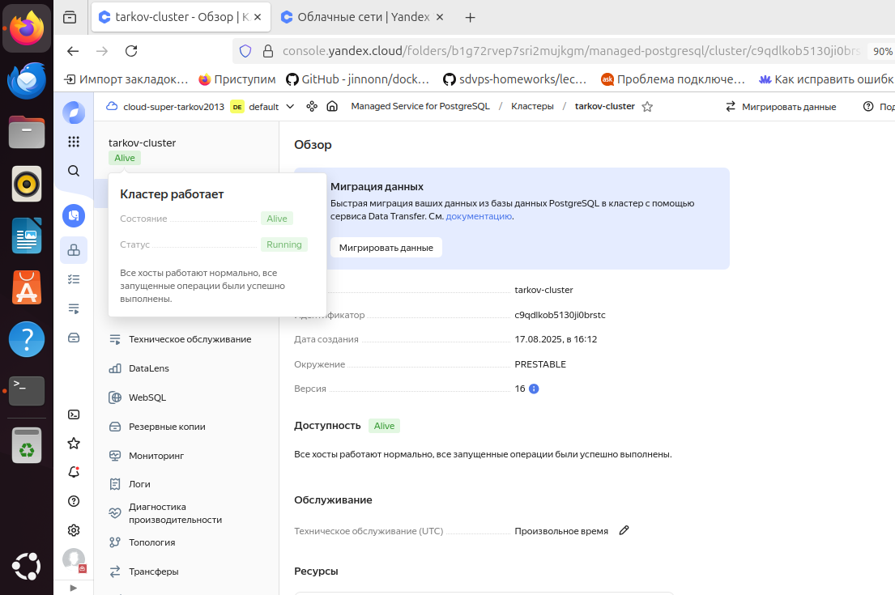
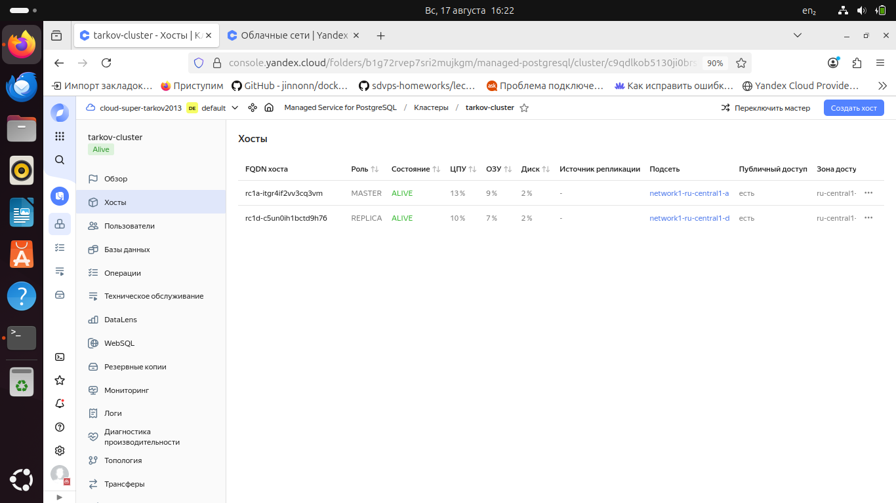

Для подключения к кластеру необходимо, чтобы группы безопасности содержали правила, которые разрешают трафик с определенных портов, IP-адресов или из других групп безопасности.

Для этого создается следующее правило для входящего трафика:

   - Диапазон портов — 6432.
   - Протокол — TCP.
   - Источник — CIDR.
   - CIDR блоки — 0.0.0.0/0.

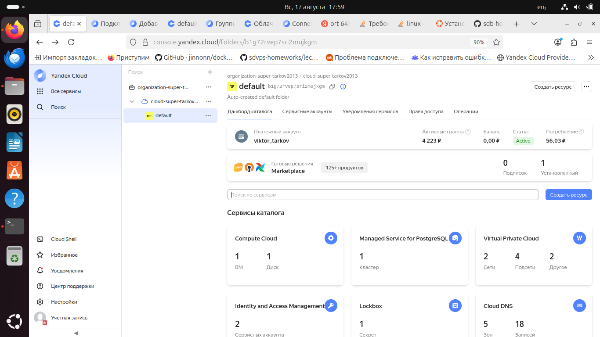
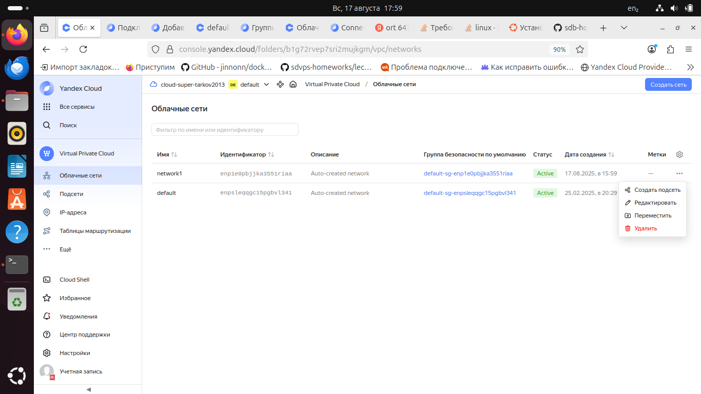
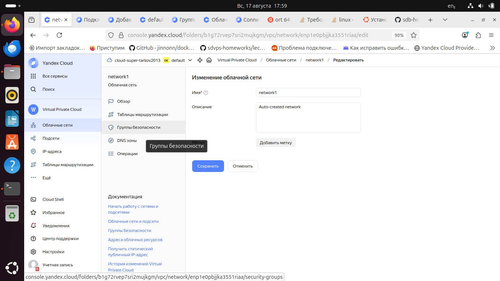
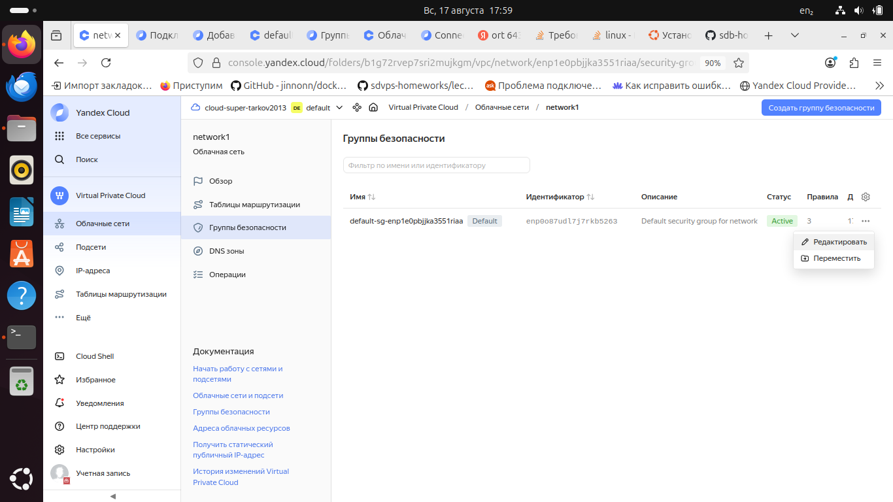
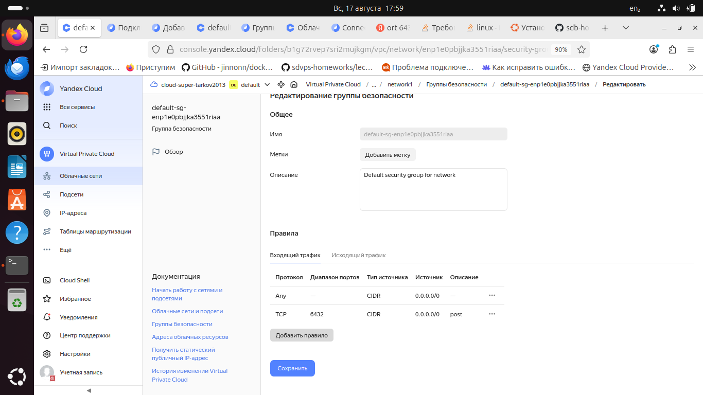

*Подключение к мастеру и реплике*

   - Используйте инструкцию по подключению к кластеру, доступную на вкладке «Обзор»: cкачайте SSL-сертификат и подключитесь к кластеру с помощью утилиты psql, указав hostname всех узлов и атрибут `target_session_attrs=read-write`.

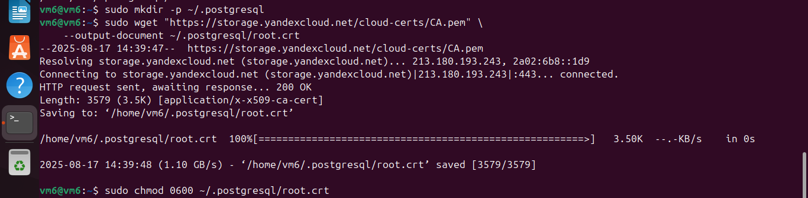
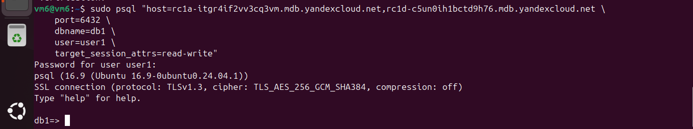

Установка утилиты:

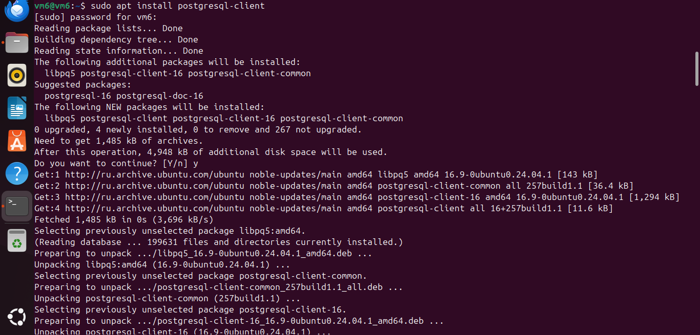

   - Проверьте, что подключение прошло к master-узлу

```python
select case when pg_is_in_recovery() then 'REPLICA' else 'MASTER' end;
```

   - Посмотрите количество подключенных реплик:

```python
select count(*) from pg_stat_replication;
```

*Проверьте работоспособность репликации в кластере*

   - Создайте таблицу и вставьте одну-две строки.

```python
CREATE TABLE test_table(text varchar);
```

```python
insert into test_table values('Строка 1');
```

   - Выйдите из psql командой `\q`

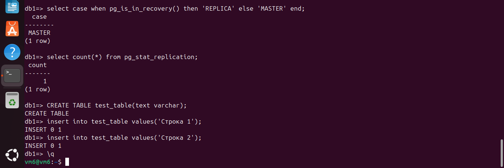

   - Теперь подключитесь к узлу-реплике. Для этого из команды подключения удалите атрибут  `target_session_attrs` и в параметре атрибут host передайте только имя хоста-реплики.  Роли хостов можно посмотреть на соответствующей вкладке UI консоли.

   - Проверьте, что подключение прошло к узлу-реплике.

```python
select case when pg_is_in_recovery() then 'REPLICA' else 'MASTER' end;
```

   - Проверьте состояние репликации

```python
select status from pg_stat_wal_receiver;
```

   - Для проверки, что механизм репликации данных работает между зонами доступности облака, выполните запрос к таблице, созданной на предыдущем шаге:

```python
select * from test_table;

```
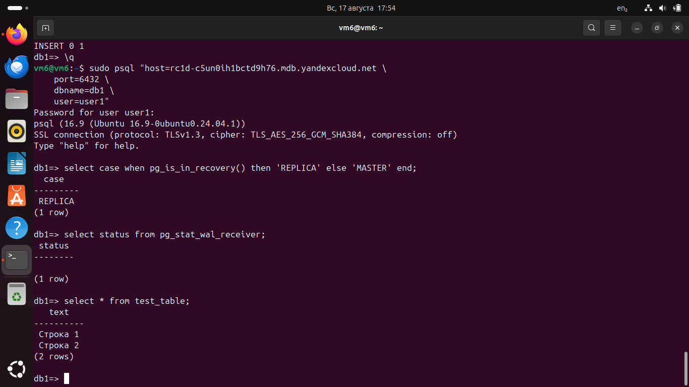


*В качестве результата вашей работы пришлите скриншоты:*
*1) Созданной базы данных; 2) Результата вывода команды на реплике `select * from test_table;`.*

---


